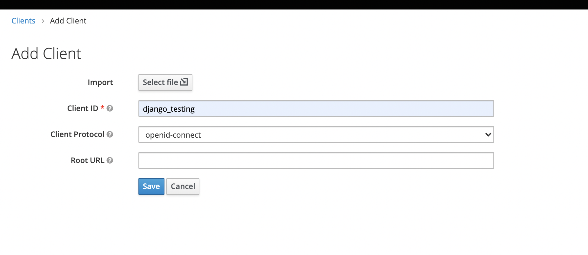
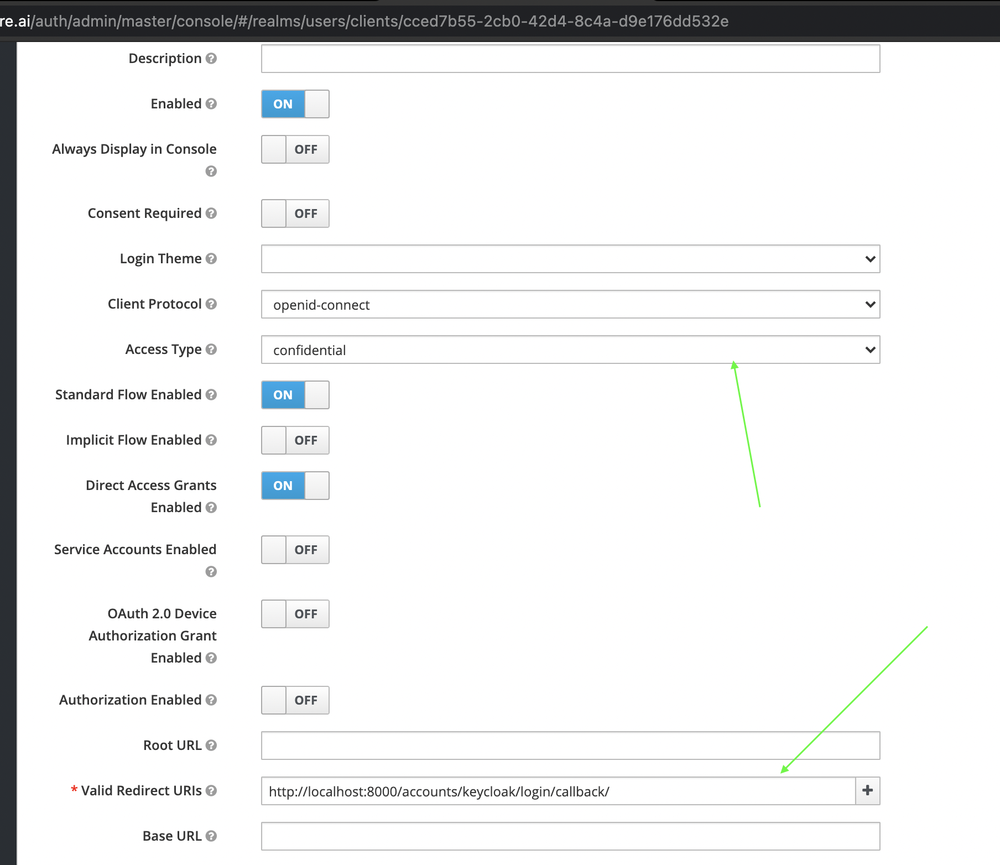
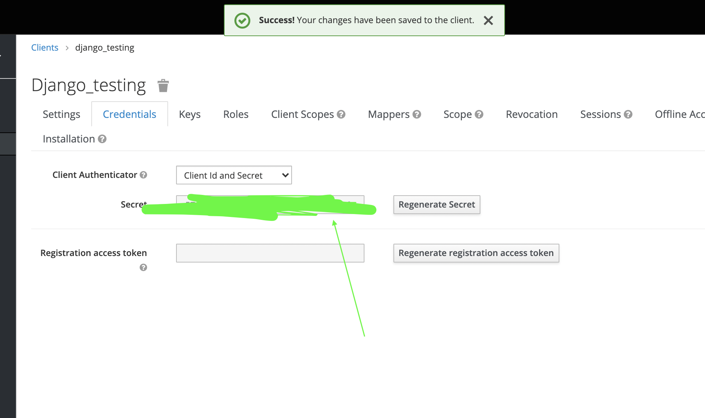
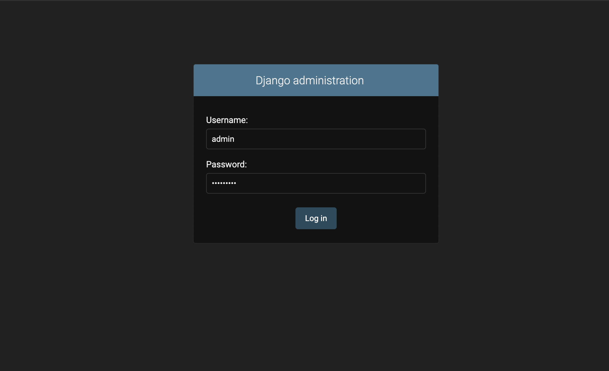
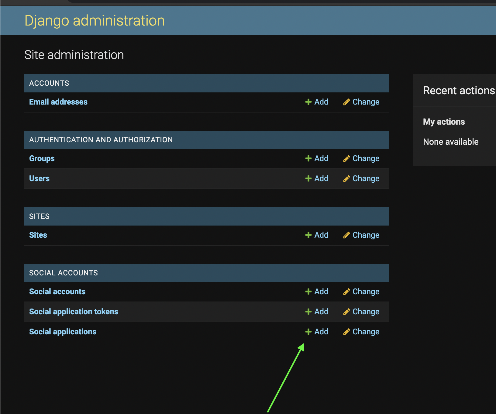
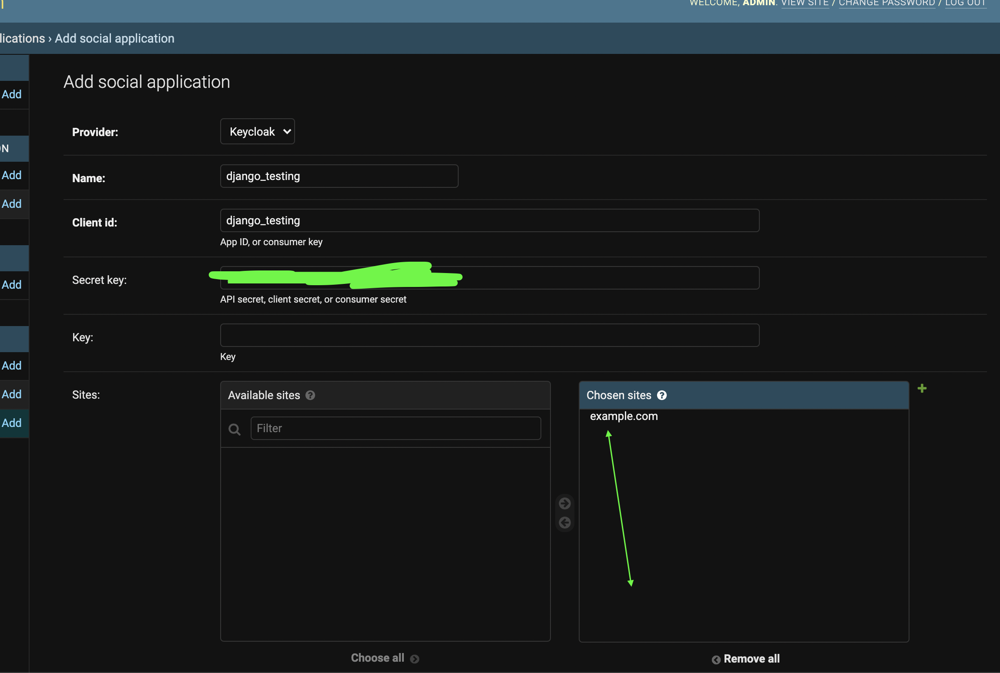
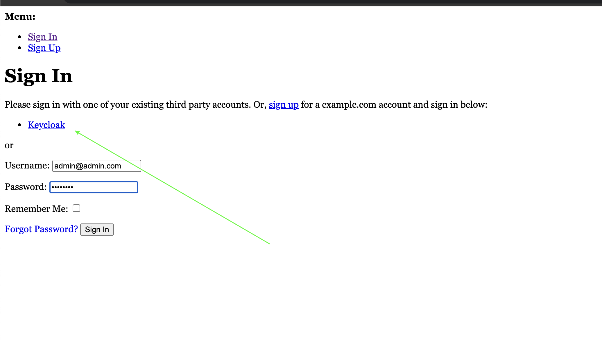

# Django + Keycloack Example

An example django project to integrate with keycloack. This works by using [django-allauth](https://django-allauth.readthedocs.io/). Users from keycloak are mapped to django's user table.


How to integrate django with keycloack.


```bash
$ python manage.py migrate
Operations to perform:
  Apply all migrations: account, admin, auth, contenttypes, sessions, sites, socialaccount
Running migrations:
  Applying contenttypes.0001_initial... OK
  Applying auth.0001_initial... OK
  Applying account.0001_initial... OK
  Applying account.0002_email_max_length... OK
  Applying admin.0001_initial... OK
  Applying admin.0002_logentry_remove_auto_add... OK
  Applying admin.0003_logentry_add_action_flag_choices... OK
  Applying contenttypes.0002_remove_content_type_name... OK
  Applying auth.0002_alter_permission_name_max_length... OK
  Applying auth.0003_alter_user_email_max_length... OK
  Applying auth.0004_alter_user_username_opts... OK
  Applying auth.0005_alter_user_last_login_null... OK
  Applying auth.0006_require_contenttypes_0002... OK
  Applying auth.0007_alter_validators_add_error_messages... OK
  Applying auth.0008_alter_user_username_max_length... OK
  Applying auth.0009_alter_user_last_name_max_length... OK
  Applying auth.0010_alter_group_name_max_length... OK
  Applying auth.0011_update_proxy_permissions... OK
  Applying auth.0012_alter_user_first_name_max_length... OK
  Applying sessions.0001_initial... OK
  Applying sites.0001_initial... OK
  Applying sites.0002_alter_domain_unique... OK
  Applying socialaccount.0001_initial... OK
  Applying socialaccount.0002_token_max_lengths... OK
  Applying socialaccount.0003_extra_data_default_dict... OK
```

Create a client in keycloack. 





Copy the client secret



Create admin account

```bash
$ python manage.py createsuperuser
Username (leave blank to use 'sasank'): admin
Email address:       
Password: 
Password (again): 
Superuser created successfully.

$ python manage.py runserver
```

Open admin portal with the above admin user at http://localhost:8000/admin




Add the client details in social account of django admin.





Log out from admin. Let's try to login to our user. Open http://localhost:8000/polls


